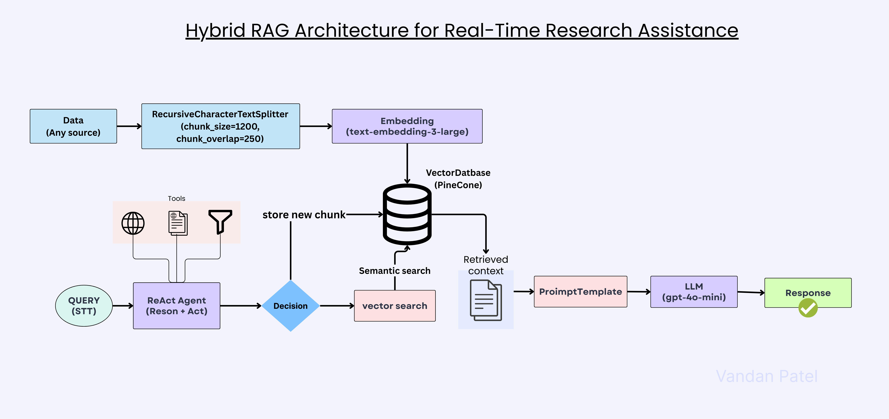

# 📚 Agentic RAG – Research Paper Question Answering System

An **Agentic Retrieval-Augmented Generation (RAG)** application that allows users to **upload research papers (PDFs)** and **ask questions** using either a **Simple Search** or an **Agent-based ReAct Search**.
The system is built using **FastAPI**, **Streamlit**, **Vector Database**, and **OpenAI Agents SDK**.
## 🧠 Architecture

Here's a high-level overview of the architecture:


---
## 🚀 Features

- 📄 Upload research papers (PDF)
- 🔍 Two search modes:
  - **Simple Search** – Standard RAG pipeline
  - **ReAct Search** – Agent-based reasoning + retrieval
- 🧠 Context-aware AI answers
- 📑 Shows retrieved document chunks with page numbers
- 🧩 Optional agent reasoning trace (ReAct mode)
- ⚡ Fast, modular, and scalable architecture

---

## 🧑‍💻 Tech Stack

### Frontend
- Streamlit

### Backend
- FastAPI
- OpenAI Agents SDK
- LangChain

### LLM
- OpenAI (`gpt-4o-mini`)

### Vector Store
- Pinecone / Chroma / FAISS (pluggable)

### Others
- Python
- Requests
- Pydantic

---

## 📁 Project Structure

```text
Agentic-RAG-Application/
│
├── backend/
│   ├── api/
│   │   ├── __init__.py
│   │   └── main.py                 # FastAPI entry point
│   │
│   ├── ai_agents/
│   │   ├── __init__.py
│   │   ├── planner_agent.py        # Task planning agent
│   │   ├── reasoning_agent.py      # Reasoning / ReAct agent
│   │   ├── react_search_agent.py   # ReAct search agent
│   │   ├── search_agent.py         # Paper search agent
│   │   ├── summarizer_agent.py     # Paper summarization agent
│   │   ├── pdf_agent.py            # PDF-specific agent
│   │   └── tools.py                # Tool definitions for agents
│   │
│   ├── tools/
│   │   ├── __init__.py
│   │   ├── search.py               # Web / arXiv search logic
│   │   ├── paper_search.py         # Research paper search
│   │   ├── arxiv_downloader.py     # Download arXiv PDFs
│   │   ├── pdf_loader.py           # Load + chunk PDFs
│   │   └── embeddings.py           # Embedding creation
│   │
│   ├── memory/
│   │   ├── __init__.py
│   │   ├── vector_store.py         # FAISS / Pinecone logic
│   │   └── session_memory.py       # Conversation memory
│   │
│   ├── data/
│   │   ├── papers/                 # Uploaded & indexed PDFs
│   │
│   ├── downloaded_papers/          # Raw downloaded PDFs
│   │
│   └── requirements.txt
│
├── frontend/
│   ├── streamlit_app.py            # Streamlit UI
│
├── .env                            # API keys
├── .gitignore
└── README.md


```


---

## 🔧 Setup Instructions

### 1️⃣ Clone the Repository
```bash
git clone https://github.com/your-username/agentic-rag-application.git
cd agentic-rag-application
```
2️⃣ Install Dependencies
```bash
python -m venv venv
venv\Scripts\activate      # Windows
```
3️⃣ Install Dependencies
```bash
pip install -r requirements.txt
```

4️⃣ Set Environment Variables

Create a .env file in the root directory:
```bash
OPENAI_API_KEY=your_openai_api_key
PINECONE_API_KEY=your_pinecone_api_key
```


# ▶️ Running the Application

Start Backend (FastAPI)
```bash 
cd backend
uvicorn api.main:app --reload
```

Backend runs at:
```bash
http://localhost:8000
```

Start Frontend (Streamlit)
```bash
cd frontend
streamlit run app.py
```
Frontend runs at:
```bash
http://localhost:8501
```